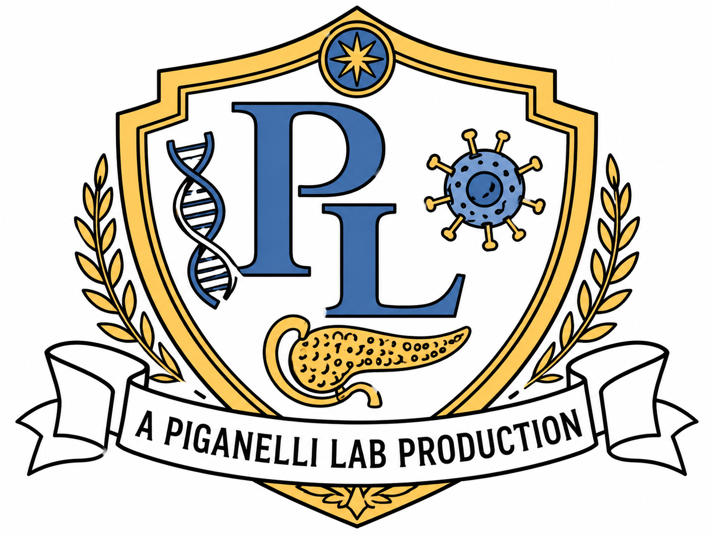

---

layout: default
title: Home
---

<section class="lab-hero">
  

  
A Piganelli Lab Production

  <h1>The Piganelli Lab</h1>

  

    Redox Immunology • T Cell Metabolism • Type 1 Diabetes
  

  

    We study how immune cells, beta cells, oxidative stress, and metabolism interact to drive autoimmune diabetes.
  

  

    <a class="button" href="research.html">Explore Research</a>
    <a class="button" href="people.html">Meet the Team</a>
    <a class="button" href="gallery.html">View Gallery</a>
  

</section>

<h2 class="section-title">Now Showing</h2>

  Our research follows the early immune events that shape type 1 diabetes, from beta cell stress and antigen recognition to T cell activation, metabolic reprogramming, and biomarker discovery.

<section class="production-grid home-production-grid">

  <article class="home-production-module">
    
Production I

    

      <h3>Redox Immunology</h3>
      
      <a href="research.html">Read more</a>
    

  </article>

  <article class="home-production-module">
    
Production II

    

      <h3>T Cell Metabolism</h3>
      
      <a href="research.html">Read more</a>
    

  </article>

  <article class="home-production-module">
    
Production III

    

      <h3>Beta Cell Stress</h3>
      
      <a href="research.html">Read more</a>
    

  </article>

  <article class="home-production-module">
    
Production IV

    

      <h3>Early Biomarkers</h3>
      
      <a href="research.html">Read more</a>
    

  </article>

  <article class="home-production-module">
    
Production V

    

      <h3>Antigen-Specific T Cells</h3>
      
      <a href="research.html">Read more</a>
    

  </article>

  <article class="home-production-module">
    
Production VI

    

      <h3>Translational Models</h3>
      
      <a href="research.html">Read more</a>
    

  </article>

</section>

<h2 class="section-title">Behind the Scenes</h2>

  

    <h3>People</h3>
    
Meet the trainees, staff, postdoctoral fellows, and scientists who make the lab run.

    <a href="people.html">Meet the team</a>
  

  

    <h3>Publications</h3>
    
Explore research articles, reviews, and featured work from the Piganelli Lab.

    <a href="publications.html">Read our work</a>
  

  

    <h3>Gallery</h3>
    
See lab life, conference moments, research images, and a little bit of science chaos.

    <a href="gallery.html">Open gallery</a>
  

  

    <h3>Lab Values</h3>
    
Learn about the principles that guide our science, mentorship, and collaboration.

    <a href="lab-values.html">View values</a>
  

