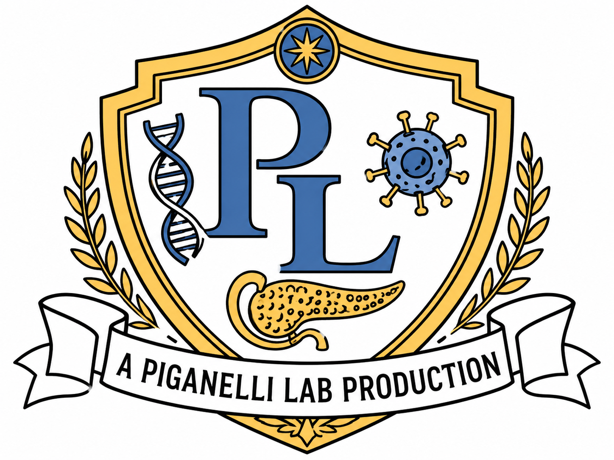

---

layout: default
title: People
---

# Production Crew

The Piganelli Lab is a collaborative research group at Indiana University School of Medicine studying type 1 diabetes, redox immunology, T cell metabolism, beta-cell stress, and early immune biomarkers.

---

<h2 class="section-title">Lab Director</h2>

<div class="scientist-card">

  <div class="scientist-sidebar">
    

```
<h3 class="scientist-name">Jon D. Piganelli, PhD</h3>

<p class="scientist-role">Principal Investigator</p>

<p class="scientist-affiliation"><strong>Professor of Medicine</strong></p>
<p class="scientist-affiliation"><strong>Professor of Biochemistry, Molecular Biology & Pharmacology</strong></p>
<p class="scientist-affiliation">Primary: Endocrinology, Department of Medicine</p>
<p class="scientist-affiliation">Secondary: Microbiology and Immunology</p>
<p class="scientist-affiliation">Indiana University School of Medicine</p>

<div class="scientist-links">
  <a class="button" href="https://www.linkedin.com/in/jon-piganelli-076505212/" target="_blank">LinkedIn</a>
  <a class="button" href="contact.html">Contact</a>
</div>
```

  </div>

  <div class="scientist-description">
    <h3>Research Focus</h3>

```
<p>
  Dr. Jon D. Piganelli leads a research program focused on the immune-mediated pathogenesis of type 1 diabetes. His work centers on T cell-mediated beta-cell destruction, redox signaling, oxidative stress, immunometabolism, beta-cell stress, and therapeutic strategies designed to slow or prevent disease progression.
</p>

<p>
  His scientific background spans immunology, microbiology, biochemistry, metabolism, endocrinology, oxidative stress, and free radical biology. The Piganelli Lab reflects both the depth of his scientific expertise and his commitment to building a collaborative environment where trainees, staff, and scientists from different backgrounds can grow together.
</p>

<p>
  Outside of his scientific leadership, Dr. Piganelli is known in the lab for his golden oldies and classic rock playlists, his interest in astrophysics, his grant-writing focus, and his habit of assigning memorable nicknames. His generosity with his time and his commitment to bringing people into science are central to the culture of the Piganelli Lab.
</p>
```

  </div>

</div>

---

<h2 class="section-title">Lab Members</h2>

<div class="scientist-card">

  <div class="scientist-sidebar">
    

```
<h3 class="scientist-name">Saptarshi Roy, PhD</h3>

<p class="scientist-role">Assistant Research Professor</p>

<p class="scientist-affiliation">Assistant Research Professor of Medicine</p>
<p class="scientist-affiliation">Department of Endocrinology / Department of Medicine</p>
<p class="scientist-affiliation">Indiana University School of Medicine</p>

<div class="scientist-links">
  <a class="button" href="https://www.linkedin.com/in/saptarshi-roy-195515180/" target="_blank">LinkedIn</a>
  <a class="button" href="contact.html">Contact</a>
</div>
```

  </div>

  <div class="scientist-description">
    <h3>Research Focus</h3>

```
<p>
  Dr. Saptarshi Roy is an Assistant Research Professor of Medicine in the Piganelli Lab at Indiana University School of Medicine. His work contributes to the lab’s studies of immune regulation, beta-cell stress, redox biology, immunometabolism, and type 1 diabetes pathogenesis.
</p>

<p>
  His training bridges parasitology, host-pathogen biology, immunology, autoimmune disease, and translational biomarker research. In the Piganelli Lab, Dr. Roy plays a central role in studying early immune events that may drive type 1 diabetes before clinical disease is fully established.
</p>

<p>
  His current work includes autoimmune diabetes, early biomarker development, viral infections associated with beta-cell stress, neoantigen formation, beta-cell autoimmunity, and soluble LAG-3 as a potential marker of early T cell activation. Beyond his scientific role, Dr. Roy is known for his dedication, technical skill, thoughtful experimental design, and strong eye for data presentation and visual communication.
</p>
```

  </div>

</div>

<div class="scientist-card">

  <div class="scientist-sidebar">
    

```
<h3 class="scientist-name">Megan Proffer</h3>

<p class="scientist-role">PhD Student</p>

<p class="scientist-affiliation">Graduate Student / Research Assistant</p>
<p class="scientist-affiliation">Department of Microbiology and Immunology</p>
<p class="scientist-affiliation">Indiana University School of Medicine</p>

<div class="scientist-links">
  <a class="button" href="https://www.linkedin.com/in/megan-proffer-4898ba292/" target="_blank">LinkedIn</a>
  <a class="button" href="contact.html">Contact</a>
</div>
```

  </div>

  <div class="scientist-description">
    <h3>Research Focus</h3>

```
<p>
  Megan is a PhD student in the Piganelli Lab. Her work focuses on early autoreactive T cell activation, antigen-specific immune responses, soluble LAG-3 as a biomarker of type 1 diabetes progression, and translational studies using mouse models and human samples.
</p>

<p>
  Her research interests include T cell activation, epitope diversification, beta-cell stress, immune biomarkers, flow cytometry, antigen-specific tetramer analysis, and the early immune events that may occur before overt type 1 diabetes.
</p>

<p>
  Megan also contributes to lab organization, science communication, website development, figure design, and trainee-centered lab culture projects.
</p>
```

  </div>

</div>

<div class="scientist-card">

  <div class="scientist-sidebar">
    

```
<h3 class="scientist-name">Mohd Sajid Lone, PhD</h3>

<p class="scientist-role">Postdoctoral Fellow</p>

<p class="scientist-affiliation">Postdoctoral Fellow in Medicine</p>
<p class="scientist-affiliation">Department of Endocrinology / Department of Medicine</p>
<p class="scientist-affiliation">Indiana University School of Medicine</p>

<div class="scientist-links">
  <a class="button" href="https://www.linkedin.com/in/mohd-sajid-lone-a398b0119/" target="_blank">LinkedIn</a>
  <a class="button" href="contact.html">Contact</a>
</div>
```

  </div>

  <div class="scientist-description">
    <h3>Research Focus</h3>

```
<p>
  Dr. Mohd Sajid Lone is a postdoctoral fellow in the Piganelli Lab. His work contributes to the lab’s research on type 1 diabetes, immune regulation, cellular stress, beta-cell biology, and mechanisms that shape autoimmune disease progression.
</p>

<p>
  His research supports the lab’s broader interest in how immune pathways, cellular stress responses, and metabolic changes contribute to autoimmune diabetes. His work helps connect mechanistic disease biology with translational approaches aimed at understanding and potentially altering disease progression.
</p>
```

  </div>

</div>

<div class="scientist-card">

  <div class="scientist-sidebar">
    

```
<h3 class="scientist-name">Virginie Lazar</h3>

<p class="scientist-role">Laboratory Technician</p>

<p class="scientist-affiliation">Research Assistant</p>
<p class="scientist-affiliation">Department of Endocrinology / Department of Medicine</p>
<p class="scientist-affiliation">Indiana University School of Medicine</p>

<div class="scientist-links">
  <a class="button" href="https://www.linkedin.com/in/virginie-lazar-8b32b461/" target="_blank">LinkedIn</a>
  <a class="button" href="contact.html">Contact</a>
</div>
```

  </div>

  <div class="scientist-description">
    <h3>Research Support</h3>

```
<p>
  Virginie supports laboratory research operations, experimental workflows, sample processing, and ongoing studies in type 1 diabetes, immunology, and beta-cell stress.
</p>

<p>
  Her work helps keep daily research activities moving forward through careful technical support, organization, and assistance with experiments that contribute to the lab’s larger autoimmune diabetes research program.
</p>
```

  </div>

</div>

<div class="scientist-card">

  <div class="scientist-sidebar">
    

```
<h3 class="scientist-name">Karly Hooper</h3>

<p class="scientist-role">Laboratory Technician</p>

<p class="scientist-affiliation">Research Assistant</p>
<p class="scientist-affiliation">Department of Endocrinology / Department of Medicine</p>
<p class="scientist-affiliation">Indiana University School of Medicine</p>

<div class="scientist-links">
  <a class="button" href="https://www.linkedin.com/in/karlyhooper/" target="_blank">LinkedIn</a>
  <a class="button" href="contact.html">Contact</a>
</div>
```

  </div>

  <div class="scientist-description">
    <h3>Research Support</h3>

```
<p>
  Karly supports laboratory research operations, experimental workflows, sample processing, and ongoing studies in type 1 diabetes, immunology, and beta-cell stress.
</p>

<p>
  Her work contributes to the organization and execution of experiments that support the lab’s research on immune activation, beta-cell stress, and autoimmune diabetes progression.
</p>
```

  </div>

</div>

---

<h2 class="section-title">Join Us</h2>

<div class="scientist-card">

  <div class="scientist-sidebar">
    

```
<h3 class="scientist-name">Join the Production</h3>

<p class="scientist-role">Trainees & Collaborators</p>

<p class="scientist-affiliation">Immunology</p>
<p class="scientist-affiliation">Type 1 Diabetes</p>
<p class="scientist-affiliation">Redox Biology</p>
<p class="scientist-affiliation">Beta-Cell Stress</p>

<div class="scientist-links">
  <a class="button" href="contact.html">Contact the Lab</a>
</div>
```

  </div>

  <div class="scientist-description">
    <h3>Interested in joining the Piganelli Lab?</h3>

```
<p>
  We welcome motivated trainees interested in immunology, type 1 diabetes, redox biology, beta-cell stress, T cell metabolism, and translational biomarker discovery.
</p>

<p>
  Prospective graduate students, postdoctoral fellows, undergraduate researchers, and collaborators are encouraged to contact the lab to learn more about current research opportunities.
</p>
```

  </div>

</div>

